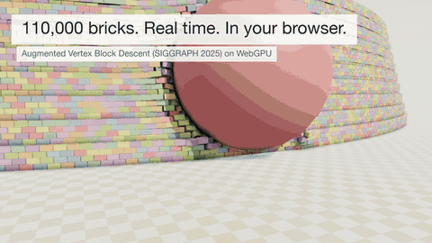

# three-avbd

Rigid-body physics on the GPU, in the browser: an implementation of *Augmented Vertex Block
Descent* ([Giles, Diaz, Yuksel — SIGGRAPH 2025](https://graphics.cs.utah.edu/research/projects/avbd/))
in TypeScript, Three.js and WGSL compute. Hundreds of thousands of bodies with contacts,
friction and joints, stepped entirely on the GPU and drawn straight from the solver's buffers.

**Live demo: [three-avbd.vercel.app](https://three-avbd.vercel.app)** ·
[2D demo](https://three-avbd.vercel.app/2d.html) ·
[Results vs the paper](https://three-avbd.vercel.app/results.html)



Needs a browser with WebGPU: Chrome or Edge on any platform, Safari 26 on macOS and iOS,
Firefox where it ships WebGPU. Nothing is baked: every scene is simulated live on your GPU.

## Use it in your project

```sh
npm install three-avbd three
```

```ts
import * as THREE from 'three/webgpu';
import { World, BodyMesh } from 'three-avbd';

const renderer = new THREE.WebGPURenderer();
const world = await World.create({ renderer, maxBodies: 50_000 }); // y-up, gravity -9.81

world.addBox({ size: [40, 1, 40], position: [0, -0.5, 0], fixed: true });
const crate = world.addBox({ size: [1, 1, 1], position: [0, 5, 0] })!;
const ball = world.addSphere({ radius: 0.5, position: [0, 7, 0], density: 3 })!;
world.addJoint(crate, ball, { anchorA: [0, 0.5, 0], anchorB: [0, -0.5, 0], breakForce: 200 });

// Every box, drawn straight from the solver's GPU buffer (a mesh per material or shape)
scene.add(new BodyMesh(world, { bodies: 'box', material: new THREE.MeshStandardNodeMaterial() }));
scene.add(new BodyMesh(world, { bodies: 'sphere' }));

renderer.setAnimationLoop(() => {
  world.update(clock.getDelta()); // fixed steps
  renderer.render(scene, camera);
});

// Poses come back from the GPU on request (an async copy): after this, crate.position is current
await world.read();
```

- **Bodies**: `addBox`, `addSphere` (position, rotation, velocity, density, friction, `fixed`);
  `body.set({ position, velocity, ... })`, `body.setFixed()`, `body.remove()` (its slot is
  reused). Adds, changes and removals go to the GPU together at the next step.
- **Joints**: `addJoint(a, b, { anchorA, anchorB, breakForce, breakOnPull })`,
  `joint.remove()`, and `world.onBreak(joint => ...)` at each readback.
- **Drawing**: `BodyMesh` takes any node material, geometry (scaled to each body's size) and
  a set of bodies (a shape, a list or a test), with `setColor(body, color)` per body.
- **Reading back**: `await world.read()` (or `world.readbackEvery = n`) for positions,
  rotations and velocities, and to learn which joints broke.
- **Headless**: `World.create({ device })` runs without a renderer (Node with Dawn, workers).
- **Advanced**: `three-avbd/advanced` exposes the solver underneath (`world.solver`) and the
  layout of its body and joint buffers, for your own compute passes over the bodies.

The design and what's planned: [docs/API.md](docs/API.md). A runnable example:
[examples/basic.ts](examples/basic.ts) (`pnpm dev`, then `/examples/basic.html`).

## What's in the demo

- **The paper's scenes.** Brick Ring (110,000 bricks, Fig. 1), Brick Walls (Fig. 3), Wall
  Smash, Breakable Wall, Chain Mail, Ragdolls on Cloth (Fig. 14), Heavy Pendulum (a 50,000:1
  mass ratio), a Flag in the Wind (pressure drag and skin friction on bodies marked as sails),
  and scale tests: Jointed Drop, box piles and Box Columns (100,000 boxes).
- **Starry Night** pours 20,000 spheres into a glass-fronted box and they come to rest as the
  painting. **Mona Lisa Tower** drops 50,000 bricks that stack into the Mona Lisa. Both lean
  on the solver being deterministic: the scene runs once off screen to find where each body
  lands, colours it from the painting there, and then runs again for real.
- **The 2D demo**: the 19 scenes of the authors' 2D demo (stacks, ropes, springs, soft
  bodies, a motor, fracture), on the CPU reference or the GPU, plus scalable box rain.
- **Custom** builds any showcase scene at a size you pick.

Controls, 3D: left-drag a body to grab it (it glows under the pointer), left-drag elsewhere to
orbit, right-drag to pan, wheel to zoom. Space, B or middle-click fires a cannonball (its
radius, mass and speed are in the scene panel, and under Settings → Advanced). P pauses, `.`
steps, R resets. 2D: left-drag grabs, right-click spawns a box, wheel zooms, shift-drag or
middle-drag pans, WASD/QE move the camera.

On a device's first visit the demo times a few solver steps off screen and remembers what
the GPU can run: a weaker GPU lands on a smaller scene, scenes that would run under 60 fps are
marked "slow here" and those under 30 fps ask before loading. Settings → Advanced measures
again.

## How it works

The whole step runs on the GPU, following the paper's Algorithm 1: a hashed-grid broadphase,
an OBB SAT narrowphase with up to eight contacts per pair, contact persistence through a hash
table (warm-started penalties and multipliers), a CSR adjacency, Jones-Plassmann graph
colouring, and then per-colour primal solves (a 6×6 LDLᵀ per body, cone friction) with a
dual update per iteration, all dispatched indirectly so the CPU never reads a count back.
Rendering is zero-copy: Three.js draws the instances from the solver's body buffer.

The GPU solvers are validated against faithful TypeScript ports of the authors' C++ demos,
which are themselves checked bit for bit against the upstream code. A seeded single step on
the GPU matches the 3D reference to 3e-6; behaviour suites cover stacking, friction, joints,
fracture and scale. Steps are deterministic on a given device, so a scene replays the same
bits every run.

Measured on an M4 Max in Chrome, against the paper's numbers on an RTX 4090:

| scene | ours | paper |
|---|---|---|
| Brick ring, 110k bricks, 4 iterations | 10.4 ms | 9.8 ms |
| Jointed drop, 34k bodies + 71k joints, 10 iterations | 6.4 ms | 16 ms (incl. cloth) |
| Brick gables, 506k bricks, 3 iterations | 25.5 ms | 17.6 ms |

Every measured decision, with how it was measured, is in [docs/FINDINGS.md](docs/FINDINGS.md);
the stages the project went through are in [docs/PLAN.md](docs/PLAN.md). The
[results page](https://three-avbd.vercel.app/results.html) compares machines; add yours from
[bench3d.html](https://three-avbd.vercel.app/bench3d.html) with "Download results".

## Running it locally

```bash
pnpm install
pnpm dev        # http://127.0.0.1:5317 (3D), /2d.html, /bench.html, /bench3d.html, /results.html
pnpm check      # typecheck + CPU tests + GPU tests (headless Dawn) + production build
```

URL parameters: `?scene=Pyramid`, `&backend=gpu` or `cpu`, `&paused`.

Benchmarks and studies, headless through Dawn (the `webgpu` package):

```bash
pnpm bench3d:gpu # 3D suite: the paper's large scenes and small ones (args: tiers or case names)
pnpm bench2d:gpu # 2D GPU benchmark with per-phase timing
pnpm bench2d     # 2D CPU scaling baseline
pnpm sweep2d     # iteration count: cost vs quality on the GPU
pnpm scaling2d   # box rain 10k-250k, writes docs/data/scaling2d-<adapter>.json
```

`pnpm bench3d:gpu <tiers> --json <file> --machine <name>` writes a report for the results
page (they live in `docs/data/bench3d/`). Keep a browser benchmark's tab visible while it runs.

## Layout

| Path | What |
|---|---|
| `src/lib/` | The npm package's public API: `World`, `Body`, `Joint`, `BodyMesh` (`three-avbd`), and `three-avbd/advanced` |
| `examples/` | Small runnable examples of the package |
| `src/avbd3d/gpu/` | 3D WebGPU solver: WGSL broadphase, OBB narrowphase, 6-DOF solve; shares the 2D colouring kernels |
| `src/avbd3d/ref/` | 3D CPU reference: faithful port of `avbd-demo3d` (quaternions, 6x6 LDLᵀ, OBB SAT, cone friction) |
| `src/avbd3d/sim.ts` | `Sim3D` interface the 3D app drives (CPU reference or WebGPU); scene registry |
| `src/avbd3d/bench-scenes.ts`, `shapes.ts` | Showcase and benchmark scenes; spheres, sails and convex hulls (GPU-only) |
| `src/avbd3d/hull.ts`, `gpu/wgsl-hull.ts` | Convex hulls: CPU hull, faces and principal-frame mass properties; GPU SAT (Gauss-map edge pruning) and face clipping against hulls, boxes and spheres |
| `src/avbd3d/painting.ts`, `tower.ts` | Starry Night and the Mona Lisa Tower |
| `src/avbd3d/bench-cases.ts`, `src/bench3d`, `src/results` | 3D benchmark suite, its browser page and the results page |
| `src/app3d/` | 3D demo app: z-up orbit camera, shadows, zero-copy instancing, drag, cannonballs |
| `src/avbd2d/ref/` | 2D CPU reference: faithful port of `avbd-demo2d` (the oracle for the later solvers) |
| `src/avbd2d/soa/` | GPU-shaped CPU solver: SoA buffers, grid broadphase, colouring, CSR (the GPU's template) |
| `src/avbd2d/gpu/` | 2D WebGPU solver: WGSL kernels, host code, `Sim2D` adapter |
| `src/app2d/`, `src/bench2d` | 2D demo app and benchmark page |
| `src/ui/` | Shared UI: scene menu and panels, title card, device budget, build progress |
| `tests/`, `tests-gpu/` | `node --test` suites; golden trajectories from the C++ demos in `tests/fixtures`; GPU tests on a real device through Dawn |
| `tools/` | The C++ oracle build, the determinism checker, the trailer rig |

## Credits and licences

MIT-licensed ([LICENSE](LICENSE)).

An implementation of *Augmented Vertex Block Descent* (Chris Giles, Elie Diaz, Cem Yuksel,
SIGGRAPH 2025). The CPU reference solvers are TypeScript ports of the authors' demos
([avbd-demo2d](https://github.com/savant117/avbd-demo2d),
[avbd-demo3d](https://github.com/savant117/avbd-demo3d), MIT, © Chris Giles), whose 2D
collision comes from [box2d-lite](https://github.com/erincatto/box2d-lite) (MIT, © Erin Catto).
Their notices, and three.js's, are in [THIRD_PARTY_NOTICES.md](THIRD_PARTY_NOTICES.md); the
build copies both files into the site. The paintings are public domain.

`pnpm fetch-reference` clones the upstream demos into `reference/` (git-ignored);
`tools/cpp-oracle/build.sh` and `gen2d.sh` / `gen3d.sh` rebuild the oracles and regenerate the
fixtures.
